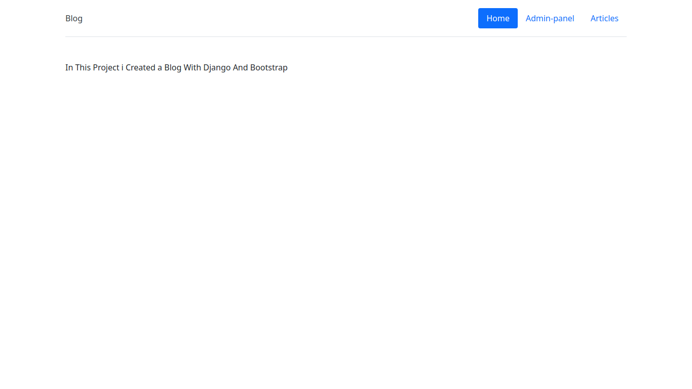

HI Guys (:
In this project i created a simple Article site with Django.

To run:
python3 manage.py runserver
************************************************************
admin passwords:
username:admin
password:12345

************************************************************

Have a good day...(;
